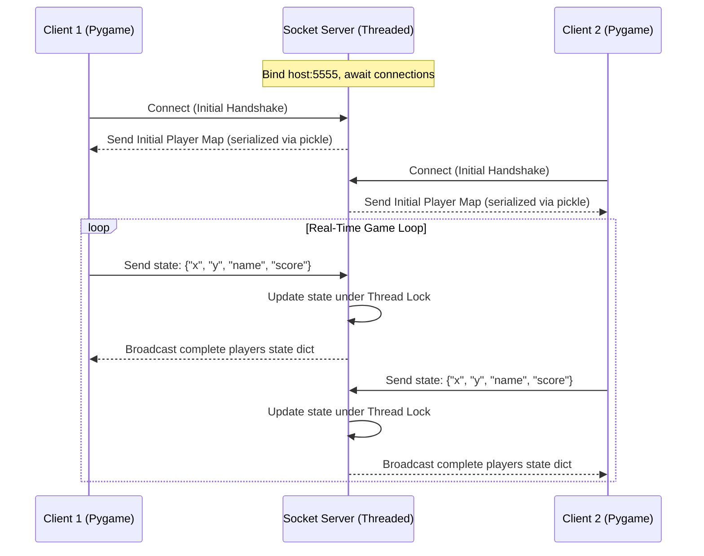
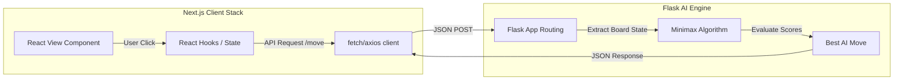

# 🚀 Ultimate Python Projects Suite

A professional-grade portfolio of **25 production-ready and educational Python applications** spanning real-time multiplayer socket games, computer vision pipelines, interactive web platforms, AI-powered assistants, and algorithmic engines. 

This repository serves as a showcase of clean code architecture, REST API design, multi-threaded networking, and full-stack integration (Python & Next.js).

---

## 🛠️ Core Technology Stack & Badges


---

## 📑 Table of Contents

- [🔍 Project Taxonomy](#-project-taxonomy)
- [⚙️ Global Installation \& Setup](#️-global-installation--setup)
- [⚡ Quick-Run Cheat Sheet (All 25 Projects)](#-quick-run-cheat-sheet-all-25-projects)
- [🧠 Architectural Highlights \& Spotlight](#-architectural-highlights--spotlight)
  - [A. Online Multiplayer Game (Socket Multi-threading)](#a-online-multiplayer-game-socket-multi-threading)
  - [B. Tic Tac Toe AI (Flask API + Next.js Frontend)](#b-tic-tac-toe-ai-flask-api--nextjs-frontend)
  - [C. Enhanced QR Tool (Streamlit + OpenCV + PIL)](#c-enhanced-qr-tool-streamlit--opencv--pil)
  - [D. AI Discord Bot (Event Loops \& OpenRouter LLM)](#d-ai-discord-bot-event-loops--openrouter-llm)
- [👨‍💻 About the Author](#-about-the-author)
- [🤝 Contributing](#-contributing)
- [📜 License](#-license)

---

## 🔍 Project Taxonomy

The repository is structured into three distinct product domains, demonstrating core software engineering principles:

### 🌐 1. Interactive Web Apps & API Services (9 Projects)
Uses Streamlit and external APIs to build responsive, rich frontends.
* **Streamlit Apps**: [User Guess Game](./User%20Guess%20Game), [Computer Guess Game](./Computer%20Guess%20Game), [Countdown Timer](./Countdown%20Timer), [Hangman](./Hangman), [Mad Libs](./Mad%20Libs), [Password Generator](./Password%20Generator), [Rock Paper Scissors](./Rock%20Paper%20Scissors), [Unit Converter App](./Unit%20Converter%20App).
* **API Integrations**: [Weather Program](./Weather%20Program) (CLI-based live weather fetch).

### 🎮 2. Graphical & Multi-threaded Games (6 Projects)
Uses Pygame rendering, keyboard event mappings, coordinate matrices, and thread locks.
* **Desktop Games**: [Ping Pong](./Ping%20Pong), [Snake Game](./Snack%20Game), [Tetris Game](./Tetris%20Game), [Connect Four](./Connect%20Four).
* **Multi-threaded Server-Client**: [Online Multiplayer Game](./Online%20Multiplayer%20Game).
* **System GUI Games**: [Minesweeper Game](./Minesweeper%20Game) (Tkinter).

### ⚙️ 3. Algorithms, Automation & Systems Utilities (10 Projects)
Classic computer science algorithms (backtracking, search trees), file I/O pipelines, custom loggers, web scrapers, and AI models.
* **Computer Vision**: [Photo Manipulation](./Photo%20Manipulation) (OpenCV matrix transforms), [QR-Code Generator & Scanner](./QR-Code%20Generator%20and%20Scanner).
* **AI & Agent Systems**: [AI Discord Bot](./Code%20a%20Discord%20Bot%20with%20Python) (OpenRouter LLM), [Tic Tac Toe with AI](./Tic%20Tac%20Toe%20with%20AI) (Flask Minimax Engine + React Client).
* **Algorithms & Compositions**: [Sudoku Solver](./Sudoku%20Solver) (Backtracking), [Binary Search](./Binary%20Search), [Markov Chain Text Composer](./Markov%20Chain%20Text%20Composer).
* **File Management & Automation**: [Bulk File Re-namer](./Bulk%20File%20Re-namer), [Web Scraping Program](./Web%20Scraping%20Program) (BeautifulSoup scrapers), [Personal Library Manager](./Personal%20Library%20Manager) (JSON serialization).

---

## ⚙️ Global Installation & Setup

All projects are self-contained and run on a unified Python environment. Follow these setup steps to configure the global workspace.

### 1. Clone the Repository
```bash
git clone https://github.com/afaqulislam/25_Python_Projects.git
cd "25 Python Projects"
```

### 2. Configure Virtual Environment
Create and activate a isolated virtual env to prevent dependency conflicts:
```bash
# Windows
python -m venv venv
venv\Scripts\activate

# macOS / Linux
python3 -m venv venv
source venv/bin/activate
```

### 3. Install Global Dependencies
Use the unified requirements configuration in the root:
```bash
pip install -r requirements.txt
```

---

## ⚡ Quick-Run Cheat Sheet (All 25 Projects)

Navigate to the project folder as listed in the directory column before running the execute command.

| # | Project Name | Category | Primary Packages | Directory Path | Execute Command |
|---|---|---|---|---|---|
| **1** | [Binary Search](./Binary%20Search) | Algorithm | CLI Standard | `Binary Search/binary_search` | `python main.py` |
| **2** | [Bulk File Re-namer](./Bulk%20File%20Re-namer) | Utility | CLI Standard | `Bulk File Re-namer/bulk_renamer` | `python main.py` |
| **3** | [Discord Bot with AI](./Code%20a%20Discord%20Bot%20with%20Python) | AI / API | `discord.py`, `dotenv`, `requests` | `Code a Discord Bot with Python/discord_bot` | `python main.py` |
| **4** | [Computer Guess Game](./Computer%20Guess%20Game) | Web App | `streamlit` | `Computer Guess Game` | `streamlit run guess_the_number_computer.py` |
| **5** | [Connect Four](./Connect%20Four) | Game | `pygame`, `numpy` | `Connect Four/connect_four` | `python main.py` |
| **6** | [Countdown Timer](./Countdown%20Timer) | Web App | `streamlit` | `Countdown Timer` | `streamlit run countdown_timer.py` |
| **7** | [Hangman](./Hangman) | Web App | `streamlit` | `Hangman` | `streamlit run hangman.py` |
| **8** | [Mad Libs](./Mad%20Libs) | Web App | `streamlit` | `Mad Libs` | `streamlit run mad_libs.py` |
| **9** | [Markov Chain Composer](./Markov%20Chain%20Text%20Composer) | Algorithm | `markovify` | `Markov Chain Text Composer/markov_chain_text_composer` | `python main.py` |
| **10**| [Minesweeper Game](./Minesweeper%20Game) | Game | GUI Standard (Tkinter) | `Minesweeper Game/minesweeper_game` | `python minesweeper_game.py` |
| **11**| [Online Multiplayer Game](./Online%20Multiplayer%20Game) | Multiplayer Game | `pygame`, `socket`, `pickle` | `Online Multiplayer Game/online_game` | Server: `python server.py`<br>Client: `python client.py` |
| **12**| [Password Generator](./Password%20Generator) | Web App | `streamlit` | `Password Generator` | `streamlit run password_generator.py` |
| **13**| [Personal Library Manager](./Personal%20Library%20Manager) | Utility | CLI Standard (JSON) | `Personal Library Manager/personal_library_manager` | `python library_manager.py` |
| **14**| [Photo Manipulation](./Photo%20Manipulation) | Computer Vision | `opencv-python`, `numpy` | `Photo Manipulation/photo_manipulation` | `python main.py` |
| **15**| [Ping Pong](./Ping%20Pong) | Game | `pygame` | `Ping Pong` | `python ping-pong.py` |
| **16**| [QR-Code Tool](./QR-Code%20Generator%20and%20Scanner) | CV / Web App | `streamlit`, `qrcode`, `opencv-python` | `QR-Code Generator and Scanner` | `streamlit run app.py` |
| **17**| [Rock Paper Scissors](./Rock%20Paper%20Scissors) | Web App | `streamlit` | `Rock Paper Scissors` | `streamlit run rock_paper_scissors.py` |
| **18**| [Snake Game](./Snack%20Game) | Game | `pygame` | `Snack Game` | `python snack-game.py` |
| **19**| [Sudoku Solver](./Sudoku%20Solver) | Algorithm | CLI Standard (Backtracking) | `Sudoku Solver/sudoku_solver` | `python sudoku_solver.py` |
| **20**| [Tetris Game](./Tetris%20Game) | Game | `pygame` | `Tetris Game/tetris_game` | `python main.py` |
| **21**| [Tic Tac Toe with AI](./Tic%20Tac%20Toe%20with%20AI) | Full-Stack AI | Flask Engine + Next.js UI | `Tic Tac Toe with AI/tic-tac-toe-ai` | Backend: `python python-backend.py`<br>Frontend: `npm run dev` |
| **22**| [Unit Converter App](./Unit%20Converter%20App) | Web App | `streamlit`, `pint` | `Unit Converter App/unit_converter_app` | `streamlit run app.py` |
| **23**| [User Guess Game](./User%20Guess%20Game) | Web App | `streamlit` | `User Guess Game` | `streamlit run guess_the_number_user.py` |
| **24**| [Weather Program](./Weather%20Program) | Utility / API | `requests` | `Weather Program/weather_app` | `python weather.py` |
| **25**| [Web Scraping Program](./Web%20Scraping%20Program) | Utility / API | `requests`, `beautifulsoup4` | `Web Scraping Program/github_profile_web_scraping` | `python main.py` |

---

## 🧠 Architectural Highlights & Spotlight

Here are the detailed design implementations of some of the most complex subsystems:

### A. Online Multiplayer Game (Socket Multi-threading)
A client-server multiplayer game using TCP socket streams to exchange real-time game vectors.

* **Concurrence & State Synchronization**: The server spawns a dedicated client thread on each incoming connection and controls state manipulation with a `threading.Lock` semaphore to prevent race conditions during updates.
* **Pickle Serialization**: Python's binary `pickle` module serializes coordinate dictionaries, scores, and names into transport packets, deserializing client states dynamically.



### B. Tic Tac Toe AI (Flask API + Next.js Frontend)
A hybrid stack application featuring an un-beatable AI adversary driven by the Minimax algorithm.

* **Minimax Core**: The Flask engine uses recursive backtracking to traverse the move decision tree. The system grades grid nodes (`+10` win, `-10` loss, `0` tie) and takes optimal decisions depending on which entity is playing (maximizing/minimizing algorithm).
* **Next.js & Flask API Hookup**: The frontend consists of a responsive Tailwind UI built with TypeScript. The React state communicates board updates via POST payloads to the Python backend `/api/move` endpoint, receiving the computer response instantly.



### C. Enhanced QR Tool (Streamlit + OpenCV + PIL)
A custom CV scanner and vector graphic generator with customized canvas styles.

* **Scan Matrix Decoding**: Incorporates OpenCV (`cv2`) to parse canvas frames. It processes local files or webcam snapshots into structured matrix pixels, decoding the grid patterns using native computer vision algorithms.
* **Graphic Customization**: Utilizes the Python Imaging Library (`PIL`) to generate QR grids with configurable background colors, gradient parameters, border buffers, and customizable target modules.

### D. AI Discord Bot (Event Loops & OpenRouter LLM)
An active discord.py bot incorporating asynchronous scheduling, ticket handlers, and LLM text generation.

* **OpenRouter Connection**: Connects to the LLM cloud API using client requests. Sends prompt arrays formatted with customized system behaviors (`"You are a helpful Discord bot"`) and responds with AI generation.
* **Custom Event Routers**: Uses asynchronous handlers (`@bot.event`) to track new membership requests (`on_member_join`), audit messages (`on_message`), delete filtered phrases, and schedule custom moderation routines.

```
💡 Configuring the AI Discord Bot:
1. Create a ".env" file inside the "Code a Discord Bot with Python/discord_bot/" directory.
2. Define the target parameters:
   DISCORD_TOKEN=your_secret_discord_bot_token
   OPENROUTER_API_KEY=your_openrouter_api_key
   OPENROUTER_MODEL=mistralai/mistral-7b-instruct:free
```

---

## 💎 Engineering Best Practices & Big-Tech Readiness

This repository is built following strict software engineering paradigms standard in top-tier technology companies:

### 1. Architectural Integrity & Design Patterns
* **Separation of Concerns (SoC)**: Frontends (Next.js, Streamlit) are completely decoupled from backend processing engines (Flask APIs, socket servers, computer vision classes).
* **State Management**: Implements clean reactive flows using React hooks, Streamlit session states, and server-side thread pools.
* **OOP & Modularity**: Utility operations (file operations, scraper parsing, mathematical computations) are modularized into helper classes to allow high testability.

### 2. Algorithmic Rigor & System Design
* **Optimized Search & Graphs**: Incorporates recursion and backtracking (Sudoku Solver, Tic Tac Toe Minimax) and state transition graphs (Markov Composer).
* **Multi-threaded Networking**: Handles multiple client connections using thread locking primitives (`threading.Lock`) to avoid synchronization anomalies.
* **Resource Management**: Implements proper socket closing, file streams (with `with` blocks), and image matrix cleanup (OpenCV processes).

### 3. Production Readiness & Linting
* **Robust Error Handling**: Standardizes try-except validation blocks and defensive programming checks to prevent crashes.
* **Environment Separation**: Uses `.env` files for security parameters to prevent credential leaks.
* **System Logging**: Integrates structured system logs (`discord.log`) for real-time observability.

---

## 💼 Career & Recruiting Portal (Open for Opportunities)

I am currently open to **Full-Time roles, Contract positions, and Technical Collaborations** in **Software Engineering, Backend Development, and AI Application Engineering**.

### 🎯 Core Technical Capabilities:
* **Backend Systems**: Python, Node.js, Flask, RESTful APIs, WebSockets, Multi-threaded Socket Programming.
* **Frontend Engineering**: Next.js, React, TypeScript, TailwindCSS, Streamlit.
* **Artificial Intelligence**: LLM Orchestration, Prompt Engineering, OpenRouter, Computer Vision (OpenCV).
* **Systems Design**: Scalable Microservices, Decoupled Architectures, Database Serialization.

📥 **Recruiter Fast-Track**: If you are looking to hire a developer with these capabilities, you can reach out directly via:
* **Email**: [afaqulislam707@gmail.com](mailto:afaqulislam707@gmail.com)
* **LinkedIn**: [Afaq Ul Islam on LinkedIn](https://www.linkedin.com/in/afaqulislam)
* **Portfolio**: [afaqulislam.github.io](https://afaqulislam.github.io)

---

## 👨‍💻 About the Author 

**Afaq Ul Islam** – *Full Stack AI Web Developer*

Passionate about crafting high-performance user interfaces, scalable APIs, and intelligent software agents. Experienced across modern tech suites including Python, Next.js, React, Node.js, and Cloud API services.

* 📫 **Connect with me:**
  * [LinkedIn](https://www.linkedin.com/in/afaqulislam)
  * [GitHub](https://github.com/afaqulislam)
  * [Portfolio Website](https://afaqulislam.github.io)

---

## 🤝 Contributing

Contributions are welcome! If you want to add more projects or improve current features, please follow these guidelines:

1. **Fork the Repository** to your profile.
2. **Create a Feature Branch** (`git checkout -b feature/NewProject`).
3. **Commit your modifications** with explicit, descriptive commit notes.
4. **Push to the branch** (`git push origin feature/NewProject`).
5. **Open a Pull Request** describing your changes.

---

## 📜 License

This repository is licensed under the **MIT License**. You are free to modify, distribute, and implement this codebase for educational and personal creations. See the [LICENSE](./LICENSE) file for more information.
